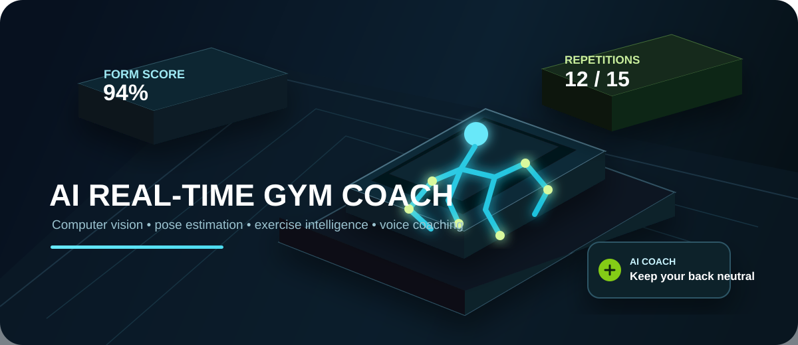
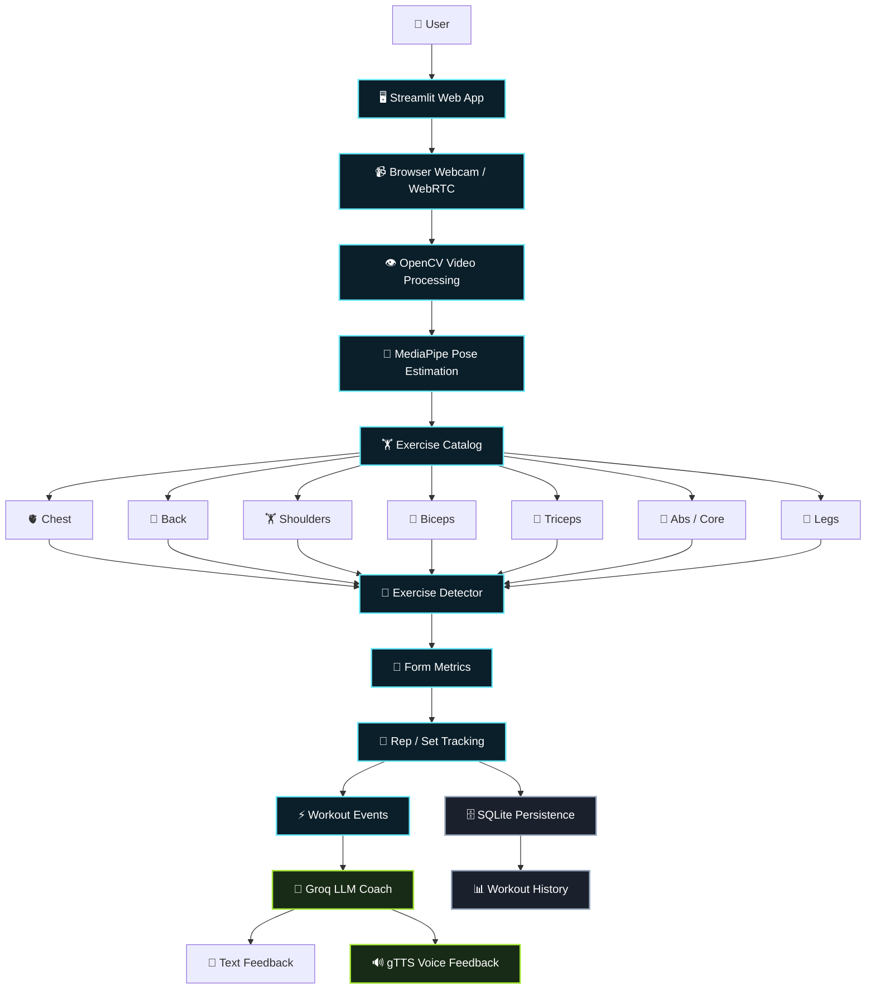

<div align="center">



# 🏋️ AI Real-Time GYM Coach

### **Your webcam becomes an intelligent personal trainer.**

Real-time **computer vision + pose estimation + exercise-specific movement analysis + LLM coaching + voice feedback** for smarter, form-aware workouts.

<p>
  <a href="https://github.com/gpraveenkumar-blip/AI-Real-time-Gym-Coach">
    
  </a>
  
  
  
  
  
  
</p>

<p>
  <strong>🎥 Live webcam tracking</strong> &nbsp;•&nbsp;
  <strong>📐 Form analysis</strong> &nbsp;•&nbsp;
  <strong>🔢 Rep & set counting</strong> &nbsp;•&nbsp;
  <strong>🤖 AI coaching</strong> &nbsp;•&nbsp;
  <strong>🔊 Voice feedback</strong>
</p>

</div>

---

## ✦ What is it?

**AI Real-Time GYM Coach** is a browser-based fitness assistant that turns a standard webcam into a real-time workout analysis system.

Instead of only asking **“How many reps?”**, the application focuses on **“How well was the rep performed?”** It extracts body landmarks with MediaPipe, routes them through exercise-specific detection logic, calculates movement/form metrics, tracks workout state, and sends meaningful workout events to an LLM coaching layer powered by Groq.

The core training loop is:

> **Move → Detect → Measure → Evaluate → Coach → Improve**

---

## ⚡ Core capabilities

| Capability | What it does |
|---|---|
| 🎯 **Pose Estimation** | Detects human body landmarks in real time using MediaPipe |
| 🏃 **Movement Detection** | Recognizes exercise-specific movement states |
| 🔢 **Rep & Set Tracking** | Tracks current reps, total reps, completed sets and targets |
| 📐 **Form Analysis** | Uses exercise-specific angles, distances and posture signals |
| 🤖 **AI Coaching** | Generates contextual workout feedback through Groq |
| 🔊 **Voice Coaching** | Converts coaching responses into spoken feedback with gTTS |
| 📊 **Workout History** | Persists and displays completed workout records |
| 🔐 **Authentication** | Provides login/session management |
| 🌐 **Browser Webcam** | Processes camera input directly in the browser |

---

# 🏆 28 Supported Exercises

The workout catalog is organized into **7 training sections with 4 exercises each**.

> **7 muscle groups × 4 exercises = 28 exercises**

Each exercise exposes metrics that can be used by the tracking/coaching layer to understand movement quality, exercise state, and form.

---

## 1. 🫀 Chest — 4 Exercises

| # | Exercise | Detection / Form Metrics |
|---:|---|---|
| 1 | **Standard Push-Ups** | Elbow Angle · Body Alignment · Hip Status |
| 2 | **Wide Push-Ups** | Elbow Angle · Body Alignment · Hip Status |
| 3 | **Incline Push-Ups** | Elbow Angle · Body Alignment · Hip Status |
| 4 | **Decline Push-Ups** | Elbow Angle · Body Alignment · Hip Status |

### Chest detector signals

```text
Elbow Angle
    │
    ├── Rep movement
    └── Depth / extension

Body Alignment
    │
    └── Full-body posture

Hip Status
    │
    ├── Neutral
    └── Incorrect / corrective feedback
```

---

## 2. 🪽 Back — 4 Exercises

| # | Exercise | Detection / Form Metrics |
|---:|---|---|
| 1 | **Superman** | Extension Angle · Lift Status |
| 2 | **Reverse Snow Angels** | Sweep Angle · Sweep Status |
| 3 | **Prone Y-T-W Raises** | Lift Amount · Raise Status |
| 4 | **Backpack Rows** | Elbow Angle · Hinge Status |

### Back detector signals

```text
Extension Angle ──► Superman
Sweep Angle ──────► Reverse Snow Angels
Lift Amount ──────► Y-T-W Raises
Elbow Angle ──────► Backpack Rows
Hinge Status ─────► Row form
```

---

## 3. 🏋️ Shoulders — 4 Exercises

| # | Exercise | Detection / Form Metrics |
|---:|---|---|
| 1 | **Pike Push-Ups** | Elbow Angle · Pike Status |
| 2 | **Shoulder Taps** | Tap Distance · Tap Status |
| 3 | **Wall Handstand Hold** | Hold Status |
| 4 | **Arm Circles** | Circle Progress |

### Shoulder detector signals

```text
Pike Push-Ups
    └── Elbow Angle + Pike Status

Shoulder Taps
    └── Tap Distance + Tap Status

Wall Handstand Hold
    └── Hold Status

Arm Circles
    └── Circle Progress (degrees)
```

---

## 4. 💪 Biceps — 4 Exercises

| # | Exercise | Detection / Form Metrics |
|---:|---|---|
| 1 | **Backpack Curls** | Elbow Angle · Shoulder Status · Swing Status |
| 2 | **Towel Curls** | Elbow Angle · Shoulder Status · Swing Status |
| 3 | **Isometric Biceps Hold** | Elbow Angle · Hold Status |
| 4 | **Resistance-Band Curls** | Elbow Angle · Shoulder Status · Swing Status |

### Biceps detector signals

```text
Elbow Angle
    │
    ├── Curl contraction
    └── Arm extension

Shoulder Status
    └── Helps detect unwanted shoulder movement

Swing Status
    └── Helps identify momentum-driven curls
```

> **Curl variants use the same core detector logic**, while the exercise name determines the selected workout configuration.

---

## 5. 🔱 Triceps — 4 Exercises

| # | Exercise | Detection / Form Metrics |
|---:|---|---|
| 1 | **Diamond Push-Ups** | Elbow Angle · Body Alignment · Hip Status |
| 2 | **Chair Dips** | Elbow Angle · Depth Status |
| 3 | **Close-Grip Push-Ups** | Elbow Angle · Body Alignment · Hip Status |
| 4 | **Overhead Backpack Extension** | Elbow Angle · Elbow Status |

### Triceps detector signals

```text
Elbow Angle
    │
    ├── Rep phase
    └── Extension / contraction

Body Alignment
    └── Push-up posture

Hip Status
    └── Detects unwanted hip position

Depth / Elbow Status
    └── Exercise-specific form feedback
```

---

## 6. 🧱 Abs / Core — 4 Exercises

| # | Exercise | Detection / Form Metrics |
|---:|---|---|
| 1 | **Plank** | Body Angle · Form Status |
| 2 | **Bicycle Crunches** | Touch Distance · Crunch Status |
| 3 | **Leg Raises** | Hip Angle · Leg Status |
| 4 | **Mountain Climbers** | Drive Angle · Climb Status |

### Core detector signals

```text
Plank
    └── Body Angle + Form Status

Bicycle Crunches
    └── Touch Distance + Crunch Status

Leg Raises
    └── Hip Angle + Leg Status

Mountain Climbers
    └── Drive Angle + Climb Status
```

---

## 7. 🦵 Legs — 4 Exercises

| # | Exercise | Detection / Form Metrics |
|---:|---|---|
| 1 | **Bodyweight Squats** | Knee Angle · Back Angle · Depth Status |
| 2 | **Reverse Lunges** | Front Knee Angle · Torso Angle · Balance Status |
| 3 | **Bulgarian Split Squats** | Front Knee Angle · Depth Status |
| 4 | **Glute Bridges** | Hip Angle · Bridge Status |

### Legs detector signals

```text
Bodyweight Squats
    └── Knee Angle + Back Angle + Depth

Reverse Lunges
    └── Front Knee Angle + Torso Angle + Balance

Bulgarian Split Squats
    └── Front Knee Angle + Depth

Glute Bridges
    └── Hip Angle + Bridge Status
```

---

## 📊 Exercise Coverage

```text
🫀 CHEST        ████  4
🪽 BACK         ████  4
🏋️ SHOULDERS   ████  4
💪 BICEPS       ████  4
🔱 TRICEPS      ████  4
🧱 ABS / CORE   ████  4
🦵 LEGS         ████  4
                 ────
                  28
```

| Training Section | Exercises | Primary Signals |
|---|---:|---|
| 🫀 Chest | **4** | Elbow angle, alignment, hip position |
| 🪽 Back | **4** | Extension, sweep, lift, elbow/hinge |
| 🏋️ Shoulders | **4** | Elbow, pike, tap, hold, circle |
| 💪 Biceps | **4** | Elbow, shoulder stability, swing, hold |
| 🔱 Triceps | **4** | Elbow, alignment, depth, hip position |
| 🧱 Abs / Core | **4** | Body angle, touch distance, hip/drive angle |
| 🦵 Legs | **4** | Knee, back, torso, hip, depth, balance |

---

# 🧠 Exercise Intelligence

The exercise system is designed around **exercise-specific detector logic**, rather than treating every movement as the same generic classifier.

Conceptually:

```text
                  ┌─────────────────────┐
                  │   Exercise Selected │
                  └──────────┬──────────┘
                             │
                             ▼
                  ┌─────────────────────┐
                  │  Pose Landmarks     │
                  │      MediaPipe      │
                  └──────────┬──────────┘
                             │
                             ▼
                  ┌─────────────────────┐
                  │ Exercise Detector   │
                  └──────────┬──────────┘
                             │
             ┌───────────────┼───────────────┐
             ▼               ▼               ▼
        Joint Angles     Distances      Posture State
             │               │               │
             └───────────────┼───────────────┘
                             ▼
                  ┌─────────────────────┐
                  │ Form / Movement     │
                  │ Evaluation          │
                  └──────────┬──────────┘
                             │
                             ▼
                  ┌─────────────────────┐
                  │ Rep / Set Tracking  │
                  └──────────┬──────────┘
                             │
                             ▼
                  ┌─────────────────────┐
                  │ Workout Event       │
                  └──────────┬──────────┘
                             │
                             ▼
                  ┌─────────────────────┐
                  │     AI Coach        │
                  │       Groq          │
                  └──────────┬──────────┘
                             │
                    ┌────────┴────────┐
                    ▼                 ▼
               💬 Text             🔊 Voice
```

This design makes it possible to add exercise variants while reusing detector logic where the movement mechanics are equivalent.

---

# 🧬 System Architecture



---

# 🔄 Real-Time Coaching Pipeline

```text
📹 Camera Frame
      │
      ▼
🎯 Pose Landmarks
      │
      ▼
🏋️ Selected Exercise
      │
      ▼
🧠 Exercise Detector
      │
      ├──────────────► Joint / body metrics
      │
      ├──────────────► Movement state
      │
      └──────────────► Form status
      │
      ▼
🔢 Rep + Set Tracker
      │
      ▼
⚡ Workout Event
      │
      ▼
🤖 Groq AI Coach
      │
      ├──────────────► 💬 Text feedback
      │
      └──────────────► 🔊 Voice feedback
```

---

# 🧱 Project Structure

```text
AI-Real-time-GYM-Coach/
│
├── 📁 coach_app/
│   │
│   ├── 📁 detectors/
│   │   ├── __init__.py
│   │   │
│   │   ├── 🪽 back_backpack_row.py
│   │   ├── 🪽 back_prone_ytw_raise.py
│   │   ├── 🪽 back_reverse_snow_angel.py
│   │   ├── 🪽 back_superman.py
│   │   │
│   │   ├── 💪 biceps_curl.py
│   │   ├── 💪 biceps_isometric_hold.py
│   │   │
│   │   ├── 🧱 core_bicycle_crunch.py
│   │   ├── 🧱 core_leg_raise.py
│   │   ├── 🧱 core_mountain_climber.py
│   │   ├── 🧱 core_plank.py
│   │   │
│   │   ├── ⚙️ home_workout.py
│   │   │
│   │   ├── 🦵 legs_bulgarian_split_squat.py
│   │   ├── 🦵 legs_glute_bridge.py
│   │   ├── 🦵 lunges.py
│   │   │
│   │   ├── 🫀 pushup.py
│   │   │
│   │   ├── 🏋️ shoulder_press.py
│   │   ├── 🏋️ shoulders_arm_circle.py
│   │   ├── 🏋️ shoulders_pike_pushup.py
│   │   ├── 🏋️ shoulders_shoulder_tap.py
│   │   ├── 🏋️ shoulders_wall_handstand_hold.py
│   │   │
│   │   ├── 🦵 squat.py
│   │   │
│   │   ├── 🔱 triceps_chair_dip.py
│   │   └── 🔱 triceps_overhead_extension.py
│   │
│   ├── 📁 core/
│   │   └── base_exercise.py
│   │
│   ├── 📁 services/
│   │   ├── 🔐 auth/
│   │   ├── 🤖 coaching/
│   │   ├── ⚙️ config/
│   │   ├── 💾 persistence/
│   │   ├── 🔄 state/
│   │   └── 📊 tracking/
│   │
│   ├── 📁 ml_models/
│   │   └── pose_landmarker_full.task
│   │
│   ├── 📁 static/
│   ├── 📁 .streamlit/
│   │
│   ├── 🐍 main.py
│   ├── 🔊 text_tts.py
│   └── 🗄️ data.db
│
├── 📁 assets/
│   └── gym-coach-hero.svg
│
├── 📄 requirements.txt
├── 📄 .gitignore
├── 📄 LICENSE
└── 📄 README.md
```
---

# 🔄 System Flow

```text

                    👤 USER
                       │
                       ▼
              ┌─────────────────┐
              │  🖥️ Streamlit   │
              │     main.py     │
              └────────┬────────┘
                       │
                       ▼
              📹 Webcam / WebRTC
                       │
                       ▼
              👁️ OpenCV Processing
                       │
                       ▼
             🎯 MediaPipe Pose
                       │
                       ▼
          ┌────────────────────────┐
          │    🧭 Detector Layer   │
          │  coach_app/detectors/  │
          └───────────┬────────────┘
                      │
       ┌──────────────┼──────────────┐
       ▼              ▼              ▼
    🫀 Chest       🪽 Back        💪 Biceps
    1 module       4 modules       2 modules
       │              │              │
       ├──────────────┼──────────────┤
       ▼              ▼              ▼
    🏋️ Shoulders   🔱 Triceps    🧱 Core
    5 modules       2 modules      4 modules
       │              │              │
       └──────────────┼──────────────┘
                      ▼
                  🦵 Legs
                  3 modules
                      │
                      ▼
              📐 Form Analysis
                      │
          ┌───────────┼───────────┐
          ▼           ▼           ▼
      Joint Angles  Distance   Posture
          │           │           │
          └───────────┼───────────┘
                      ▼
              🔢 Rep / Set Tracking
                      │
                      ▼
               ⚡ Workout Events
                      │
          ┌───────────┴───────────┐
          ▼                       ▼
    🤖 Groq AI Coach          💾 SQLite
          │                       │
          ▼                       ▼
     💬 Feedback            📊 History
          │
          ▼
     🔊 gTTS Voice

```
---

> The repository currently organizes detector implementations by movement family. The **28-exercise catalog above** represents the exercise configurations/variants exposed by the project, including variants that reuse the same underlying detector logic.

---

# 🛠️ Technology Stack

| Layer | Technology | Role |
|---|---|---|
| Runtime | **Python 3.10+** | Core application |
| UI | **Streamlit** | Interactive web interface |
| Camera | **streamlit-webrtc** | Browser webcam streaming |
| Vision | **OpenCV** | Frame/video processing |
| Pose | **MediaPipe** | Human body landmark detection |
| Data | **Pandas** | Workout data processing |
| AI | **Groq** | LLM-powered coaching |
| Voice | **gTTS** | Text-to-speech feedback |
| Configuration | **python-dotenv** | Environment variables |
| Persistence | **SQLite** | User and workout data |

> Exact dependency versions are defined by `requirements.txt`.

---

# 🚀 Getting Started

## Prerequisites

Before running the application, make sure you have:

- Python **3.10+**
- A working webcam
- A modern web browser
- Internet access for AI coaching
- A Groq API key

## 1. Clone the repository

```bash
git clone https://github.com/gpraveenkumar-blip/AI-Real-time-Gym-Coach.git
```

## 2. Create a virtual environment

### Windows

```bash
python -m venv venv
venv\Scripts\activate
```

### macOS / Linux

```bash
python3 -m venv venv
source venv/bin/activate
```

## 3. Install dependencies

```bash
pip install -r requirements.txt
```

## 4. Configure the Groq API key

Create a `.env` file in the appropriate application directory:

```env
GROQ_API_KEY=your_groq_api_key_here
```

The application can also read the key from Streamlit secrets.

> ⚠️ **Never commit API keys, `.env` files, or other secrets to Git.**

## 5. Start the application

```bash
cd coach_app
streamlit run main.py
```

Then open the local Streamlit URL displayed in your terminal.

---

# 🎮 How to Use

| Step | Action |
|---:|---|
| **1** | 🔐 Login through the application |
| **2** | 🏋️ Select one of the available exercises |
| **3** | 🎯 Configure sets and repetitions |
| **4** | 📹 Start the workout and allow camera access |
| **5** | 🧍 Position your body clearly inside the camera frame |
| **6** | 🏃 Perform the selected exercise |
| **7** | 📐 Let the detector analyze movement and form |
| **8** | 🔢 Track repetitions and sets automatically |
| **9** | 🤖 Receive AI-generated coaching |
| **10** | 🔊 Listen to voice feedback |
| **11** | 📊 Review completed workout history |

---

# 📐 Form Analysis

Different exercises expose different metrics because movement quality cannot be evaluated with one universal measurement.

### Example: Push-Up Family

```text
Elbow Angle
     +
Body Alignment
     +
Hip Status
     │
     ▼
Push-Up Form Evaluation
     │
     ▼
Rep / Form Feedback
```

### Example: Squat

```text
Knee Angle
     +
Back Angle
     +
Depth Status
     │
     ▼
Squat Form Evaluation
```

### Example: Biceps Curl

```text
Elbow Angle
     +
Shoulder Status
     +
Swing Status
     │
     ▼
Curl Form Evaluation
```

This exercise-specific approach allows the coach to produce feedback that is relevant to the movement being performed.

---

# 🤖 AI Coaching

The AI coaching layer receives workout events and tracked exercise metrics, then produces contextual feedback.

```text
Workout Event
      │
      ▼
Tracked Exercise Metrics
      │
      ▼
┌──────────────────────┐
│    Groq LLM Coach    │
│ Context-aware advice │
└──────────┬───────────┘
           │
      ┌────┴─────┐
      ▼          ▼
   Text UI      gTTS
                  │
                  ▼
           🔊 Voice Coaching
```

The separation between **movement tracking** and **AI coaching** keeps the architecture modular and makes it easier to evolve the coaching experience independently from exercise detection.

---

# 🗄️ Workout Tracking & History

During a workout, the system can track:

- Total repetitions
- Current-set repetitions
- Completed sets
- Target sets
- Repetitions per set
- Exercise-specific form metrics
- Workout duration
- Exercise performed
- Workout date

Completed sessions can then be persisted and reviewed through the application's workout history functionality.

---

# 🧩 Configuration & Services

The project separates major responsibilities into dedicated service areas:

```text
web_app/services/
│
├── auth/          → Authentication
├── coaching/      → LLM + voice coaching
├── config/        → Application / workout configuration
├── persistence/   → Database access
├── state/         → Streamlit session state
└── tracking/      → Rep / set / metric tracking
```

This separation reduces coupling between the UI, computer vision pipeline, workout state, persistence layer, and AI coaching system.

---

# ➕ Adding More Exercises

The modular detector architecture makes it possible to introduce additional exercises without rewriting the entire application.

A new exercise generally requires:

1. Define the exercise configuration.
2. Identify the required MediaPipe landmarks.
3. Calculate relevant joint angles/distances.
4. Define movement states.
5. Define repetition detection logic.
6. Define form-validation rules.
7. Define exercise-specific metrics/status values.
8. Register the exercise in the workout configuration.
9. Connect the resulting metrics to the coaching/event layer.

### Reusing detector logic

For exercise variants with the same movement mechanics, the same detector can be reused.

For example:

```text
Push-Up Detector
      │
      ├── Standard Push-Ups
      ├── Wide Push-Ups
      ├── Incline Push-Ups
      └── Decline Push-Ups
```

Similarly:

```text
Curl Detector
      │
      ├── Backpack Curls
      ├── Towel Curls
      └── Resistance-Band Curls
```

This keeps the codebase maintainable while allowing the UI to present a larger exercise library.

---

# 🎯 Recommended Camera Setup

For the most reliable pose detection:

- Use a well-lit environment.
- Keep the entire body visible whenever the exercise requires it.
- Keep the camera stable.
- Position the camera at an appropriate height.
- Avoid excessive background movement.
- Avoid having multiple people in the frame.
- Use clothing that makes body movement distinguishable.
- Avoid extreme camera angles.
- Maintain a reliable internet connection for AI coaching.

> Real-time performance can vary based on camera resolution, CPU/GPU availability, browser performance, lighting, and network conditions.

---

# 🐛 Troubleshooting

## Camera does not start

- Check browser camera permissions.
- Ensure another application is not exclusively using the webcam.
- Use a supported modern browser.
- Verify `streamlit-webrtc` is installed correctly.

## AI coaching does not work

- Verify `GROQ_API_KEY` is configured.
- Check terminal output for API/network errors.
- Confirm the machine has internet access.

## Pose detection is inaccurate

- Improve lighting.
- Move farther from the camera.
- Keep the required body landmarks visible.
- Avoid excessive background clutter.
- Keep the camera stable.
- Avoid extreme viewing angles.

## Application fails during startup

Reinstall dependencies:

```bash
pip install -r requirements.txt
```

Then run Streamlit from the application directory:

```bash
cd web_app
streamlit run main.py
```

---

# ⚠️ Known Limitations

Camera-based pose estimation can be affected by:

- Poor lighting
- Occluded body joints
- Incorrect camera positioning
- Multiple people in the frame
- Extreme camera angles
- Fast movements
- Partially hidden movements
- Low camera quality
- Network availability for AI coaching

Therefore, repetition counting and form assessment may vary across exercises and environments.

---

# 🔐 Safety Notice

This project is intended for **educational and fitness-assistance purposes**.

AI-generated feedback is **not a substitute for professional medical, physiotherapy, or personal-training advice**.

Stop exercising if you experience pain, dizziness, or other concerning symptoms and seek appropriate professional guidance when necessary.

---

# 🔭 Roadmap

### Exercise Intelligence

- [x] 28-exercise catalog
- [x] 7 workout categories
- [x] Exercise-specific metrics
- [ ] Additional advanced detectors
- [ ] Improved form classification
- [ ] Model confidence indicators
- [ ] More exercise-specific coaching rules

### AI Coaching

- [x] LLM coaching pipeline
- [x] Context-aware workout feedback
- [x] Voice feedback
- [ ] Reduced voice-coaching latency
- [ ] Multilingual coaching
- [ ] Personalized coaching profiles
- [ ] Automated workout recommendations

### Analytics

- [x] Workout history
- [ ] Workout analytics dashboard
- [ ] Progress charts
- [ ] Exercise performance trends
- [ ] Personal records
- [ ] Calorie estimation

### Platform

- [ ] Mobile-friendly experience
- [ ] Cloud-based user profiles
- [ ] Deployment configuration
- [ ] Automated tests
- [ ] CI/CD
- [ ] Improved observability and error handling

---

# 🧪 Project Highlights

This project demonstrates practical integration of:

**Computer Vision** · **Human Pose Estimation** · **Real-Time Video Processing** · **Exercise Recognition** · **Rule-Based Movement Analysis** · **LLM Integration** · **Voice AI** · **Text-to-Speech** · **Stateful Web Applications** · **SQLite Persistence** · **Modular Python Architecture**

---

# 🏗️ Architecture Principles

| Layer | Responsibility |
|---|---|
| **Presentation** | Streamlit UI |
| **Real-Time Processing** | WebRTC → video processing → pose estimation |
| **Exercise Intelligence** | Exercise configuration → detector → form metrics |
| **Workout Tracking** | Movement state → reps → sets → workout events |
| **AI Layer** | Workout events → Groq LLM → feedback → TTS |
| **Persistence** | User/workout data → SQLite → history |

The architecture keeps UI, computer vision, exercise logic, tracking, AI coaching, and persistence separated so each part can evolve independently.

---

# 👤 Author

**Praveen Kumar**

Built as an AI-powered fitness technology project combining computer vision, pose estimation, real-time exercise tracking, form analysis, and generative AI coaching.

---

# 🤝 Contributing

Contributions are welcome.

A useful contribution can include:

- New exercise detectors
- Improved form metrics
- Better pose-analysis logic
- UI improvements
- AI coaching improvements
- Performance optimizations
- Tests
- Documentation

### Suggested contribution flow

```bash
git checkout -b feature/new-exercise
# Make your changes
git add .
git commit -m "feat: add new exercise detector"
git push origin feature/new-exercise
```

Then open a pull request with a clear explanation of the changes.

---

# 📄 License

This project is licensed under the **MIT License**. See [`LICENSE`](LICENSE) for details.

---

# 🙌 Acknowledgements

Built with:

- [Streamlit](https://streamlit.io/)
- [streamlit-webrtc](https://github.com/whitphx/streamlit-webrtc)
- [MediaPipe](https://developers.google.com/mediapipe)
- [OpenCV](https://opencv.org/)
- [Pandas](https://pandas.pydata.org/)
- [Groq](https://groq.com/)
- [gTTS](https://gtts.readthedocs.io/)

---

<div align="center">

## 🏋️ AI + Computer Vision + Fitness = Smarter Workouts

**28 Exercises · 7 Training Categories · Real-Time Form Analysis · AI Coaching**

⭐ **If you find this project useful, consider starring the repository.**

<br/>

<a href="https://github.com/gpraveenkumar-blip/AI-Real-time-Gym-Coach.git">
  
</a>
<a href="https://github.com/gpraveenkumar-blip/AI-Real-time-Gym-Coach/issues">
  
</a>

</div>
